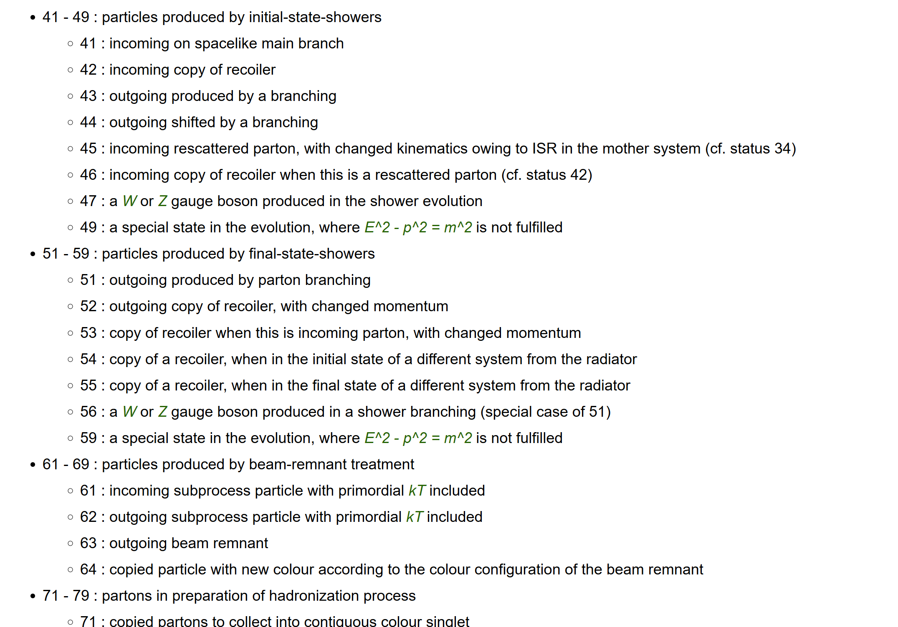

# This is Repositories for delphes study.

## Codes
	- test_particles        : print 'Particle.'로 시작하는 브랜치 목록:"

	- test_mass.py          : print paritcles.mass and status which paritcle's PID is 6 or -6

	- test_mass_islast.py   : print paritcles.mass and status which paritcle's PID is 6 or -6 and status ==62

	- tops_logs.log         : output of test_mass.py

	- tops_lastcopyonly.log : output of test_mass_islast.py

## Status code in pythia8

	
